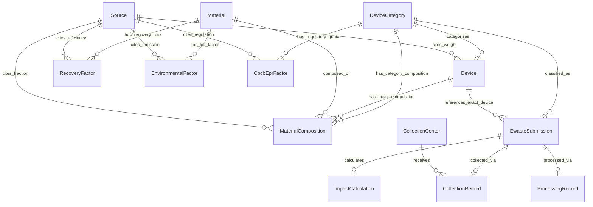
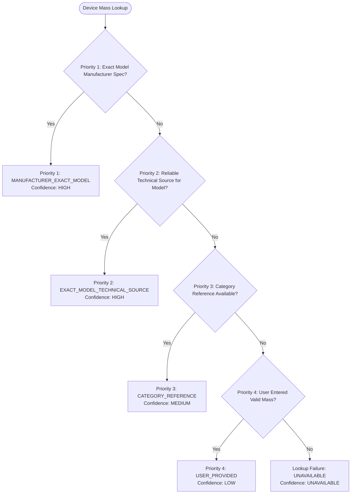

# EcoLoop Backend Specification: Architecture & Scientific Data Methodology

**Document Version:** 1.1.0  
**Project:** EcoLoop — E-Waste Circularity Management Platform  
**Target Audience:** Backend Developers, Data Engineers, Academic Evaluators  
**Status:** ARCHITECTURAL SPECIFICATION & SCIENTIFIC DATA METHODOLOGY  
**Alignment Reference:** Aligned with `REFERENCE_DATA_REQUIREMENTS.md` and `REFERENCE_DATA_V1.md`

---

## Document Conventions & Tagging Standard

To ensure rigorous separation between confirmed architectural decisions, empirical parameters requiring formal citations, implementation details, and staged feature releases, all sections and design points are classified using the following tags:

* `[DECIDED]`: Architectural, relational, or logical rule that has been finalized for the system.
* `[V1-SUPPORTED]`: Functionality grounded directly in the current V1 reference datasets and authoritative sources (`REFERENCE_DATA_V1.md`).
* `[FUTURE/EXTENSIBLE]`: Architecturally supported capability requiring additional validated reference datasets before numerical activation.
* `[SOURCE TO BE RESEARCHED]`: Parameter or empirical value where an authoritative citation must be verified before production use. No numerical constants may be hardcoded without citation.
* `[IMPLEMENTATION DETAIL]`: Specific recommendation or design choice for the developer implementing the code.
* `[OPTIONAL FUTURE FEATURE]`: Capabilities designed for subsequent iterations beyond the minimum viable academic submission.

---

# 1. Backend Responsibilities

`[DECIDED]` The EcoLoop backend acts as the authoritative engine for lifecycle estimation, custody tracking, and circular decision support. It is strictly responsible for:

1. **Device & Reference Data Lookup:** Managing hierarchical retrieval of physical equipment characteristics, material composition profiles, and recovery factors without conflating reference benchmarks with user-entered values.
2. **E-Waste Submission Lifecycle Management:** Processing new intake registrations, assigning persistent tracking codes, maintaining audit histories, and validating input constraints.
3. **Collection Tracking & Custody Verification:** Logging physical intake events at authorized collection kiosks or via logistics pickups, transitioning items from "declared" to "physically collected."
4. **Processing & Circular Pathway State Machine:** Managing deterministic state transitions (`registered` $\rightarrow$ `scheduled_for_collection` $\rightarrow$ `collected` $\rightarrow$ `processing` $\rightarrow$ `processed` $\rightarrow$ `completed`) and guarding against invalid status jumps.
5. **Deterministic Material & Recovery Calculations:**
   * `[V1-SUPPORTED]` Computing device mass, material presence, and potential material recovery for V1-ready categories (`SMARTPHONE`, `CELL_PHONE`, `LAPTOP`, `DESKTOP_PC`, and partial `MONITOR`).
   * Explicitly returning `UNAVAILABLE` for unsupported categories rather than fabricating values.
6. **Material Recovery Yield Estimation:** Applying documented Material Weight Recycling (MWR) factors and industrial recovery efficiencies to calculate recoverable secondary materials.
7. **Environmental Impact Estimation (`PARTIAL` in V1):**
   * Exposing scenario-specific lifecycle reference metrics only when backed by explicit literature scenarios (e.g., JRC smartphone biennial lifecycle analysis).
   * Returning `co2e = null` (`UNAVAILABLE`) when defensible LCA factors do not exist.
   * `[DECIDED]` Never applying a universal "kg $\text{CO}_2\text{e}$ per kg e-waste" multiplier.
8. **Regulatory Factor Separation:** Storing and exposing CPCB Extended Producer Responsibility (EPR) recoverable key-metal percentages (`cpcb_epr_recoverable_metal_factor`) strictly separately from physical material composition (`general_device_material_composition`).
9. **Rule-Based Circular Pathway Recommendations:** Evaluating device age, condition, and category against a transparent decision-tree heuristic to recommend highest-value circular retention (reuse $\rightarrow$ refurbishment $\rightarrow$ parts salvage $\rightarrow$ formal recycling).
10. **Collection Center Registry:** Maintaining directories of authorized collection facilities with licensing numbers (e.g., CPCB EPR registration), accepted waste categories, and operating availability.
11. **Dashboard Aggregations & Metrics Guard:** Computing system-wide performance indicators (`registered`, `collected`, `processed`, `material recovered`) while strictly enforcing anti-double-counting logic.
12. **Scientific Source & Provenance Tracking:** Attaching explicit bibliographical metadata (authors, year, title, DOI/URL, methodology notes, system boundary) to every calculated scientific figure.
13. **Confidence & Uncertainty Quantification:** Evaluating and reporting confidence tiers (`HIGH`, `MEDIUM`, `LOW`, `UNAVAILABLE`) and preserving ranges where single-point values are scientifically indefensible.
14. **Reference Dataset & Methodology Versioning:** Tagging every calculation with `reference_data_version` (default `"1.0"`) and `calculation_methodology_version` (default `"1.0"`).

---

# 2. Recommended Backend Architecture

`[DECIDED]` The backend architecture must prioritize academic auditability, deterministic computation, relational integrity, and maintainability.

### 2.1 Stack Selection
* **Language & Runtime:** Node.js (v20+ LTS) with TypeScript/JavaScript or Python (3.11+) with FastAPI.
* **Database:** **PostgreSQL (v15+)** or **SQLite (v3.40+)** for development/evaluation portability. PostgreSQL is recommended for strict enum constraints, JSONB support for ranges/metadata, and foreign key integrity.
* **ORM / Query Layer:** **Prisma** or **Drizzle ORM** (Node.js) / **SQLAlchemy 2.0** (Python).

### 2.2 Directory & Module Layout
`[IMPLEMENTATION DETAIL]` The codebase must be organized into decoupled modules that enforce separation between calculation logic, application persistence, and reference storage:

```text
ecoloop-backend/
├── src/
│   ├── config/                 # Environment variables, database connection, versioning
│   ├── core/                   # PURE DOMAIN & SCIENTIFIC ENGINES (Zero DB dependencies)
│   │   ├── calculator.ts       # Mass, material-presence, and MWR recovery calculations
│   │   ├── circular-rules.ts   # Rule-based pathway recommendation engine
│   │   ├── confidence.ts       # Confidence tier evaluation (HIGH, MEDIUM, LOW, UNAVAILABLE)
│   │   └── types.ts            # Mathematical & domain type definitions
│   ├── modules/                # APPLICATION SERVICES & API CONTROLLERS
│   │   ├── devices/            # Reference devices & categories controller/service
│   │   ├── submissions/        # E-waste submission intake & state management
│   │   ├── collection/         # Center directory & collection records
│   │   ├── processing/         # Dismantling & processing records
│   │   ├── impact/             # Ad-hoc calculator endpoint
│   │   ├── dashboard/          # Analytics & aggregation queries (anti-double-counting)
│   │   └── sources/            # Scientific bibliography repository
│   ├── database/
│   │   ├── schema.prisma       # Relational entity definitions
│   │   ├── migrations/         # Database migration scripts
│   │   └── seeds/              # Reference datasets (scientific vs application)
│   │       ├── reference/      # Scientific baseline V1 data (read-only in production)
│   │       │   ├── sources.seed.ts
│   │       │   ├── categories.seed.ts
│   │       │   ├── devices.seed.ts
│   │       │   ├── compositions.seed.ts
│   │       │   ├── recovery.seed.ts
│   │       │   └── cpcb-epr.seed.ts
│   │       └── sample/         # Demo users, centers, and historical submissions
│   ├── middleware/             # Validation, error handling, logging
│   └── app.ts                  # Server setup and route registration
├── tests/
│   ├── unit/                   # Math, fallback hierarchy, range preservation, MWR
│   └── integration/            # API endpoints, state transitions, double-counting
├── BACKEND_SPEC.md             # This document
├── REFERENCE_DATA_REQUIREMENTS.md
├── REFERENCE_DATA_V1.md
└── package.json
```

### 2.3 Configuration & Environment
* `DATABASE_URL`: Connection string for PostgreSQL/SQLite.
* `REFERENCE_DATA_VERSION`: Default `"1.0"`.
* `CALCULATION_METHODOLOGY_VERSION`: Default `"1.0"`.
* `NODE_ENV`: `development` | `test` | `production`.
* `PORT`: Default `5000`.

### 2.4 Error Handling & Validation
* **Validation Layer:** All incoming API payloads must pass through strict schema validation (e.g., **Zod** in TypeScript or **Pydantic** in Python).
* **Uniform Error Envelope:** All HTTP errors must return structured JSON:
  ```json
  {
    "success": false,
    "error": {
      "code": "VALIDATION_FAILED",
      "message": "The quantity must be an integer greater than zero.",
      "details": [
        { "field": "quantity", "issue": "Value -3 is less than minimum 1" }
      ]
    }
  }
  ```

---

# 3. Database Schema

`[DECIDED]` The database schema is split into two primary operational zones:
1. **Reference / Scientific Layer** (Read-mostly, cited, versioned).
2. **Application / Transactional Layer** (CRUD operations, state transitions, audit logs).



### 3.1 Scientific & Reference Tables

#### Table: `sources`
Stores every authoritative bibliography reference, research paper, government notification, or manufacturer report.
```sql
CREATE TABLE sources (
    id VARCHAR(64) PRIMARY KEY, -- e.g., 'SRC_GEM_2024', 'SRC_JRC_SMARTPHONE', 'SRC_LAPTOP_MWR_STUDY'
    short_code VARCHAR(32) NOT NULL, -- e.g., 'GEM 2024', 'JRC Smartphone 2020'
    title TEXT NOT NULL,
    authors TEXT,
    organization VARCHAR(255) NOT NULL, -- e.g., 'UNITAR / ITU', 'European Commission JRC', 'CPCB India'
    publication_year INT NOT NULL,
    source_type VARCHAR(64) NOT NULL, -- 'government', 'international_organization', 'academic_literature', 'manufacturer', 'technical_report'
    url_or_doi TEXT,
    parameters_supported TEXT[] NOT NULL, -- e.g., ['global_baseline', 'smartphone_composition', 'laptop_mwr']
    geographical_scope VARCHAR(64) NOT NULL, -- 'Global', 'Europe', 'India'
    methodology_notes TEXT,
    limitations TEXT,
    access_date DATE,
    created_at TIMESTAMP WITH TIME ZONE DEFAULT CURRENT_TIMESTAMP
);
```

#### Table: `device_categories`
Classification matching CPCB Schedule-I and WEEE categories.
```sql
CREATE TABLE device_categories (
    id VARCHAR(64) PRIMARY KEY, -- 'SMARTPHONE', 'CELL_PHONE', 'LAPTOP', 'DESKTOP_PC', 'MONITOR', etc.
    name VARCHAR(128) NOT NULL,
    cpcb_code VARCHAR(32), -- 'ITEW15', 'ITEW3', 'ITEW1', 'ITEW2', etc.
    description TEXT,
    typical_lifespan_years INT NOT NULL,
    default_weight_kg DECIMAL(8, 3) NOT NULL,
    weight_source_id VARCHAR(64) REFERENCES sources(id),
    v1_calculation_status VARCHAR(32) NOT NULL DEFAULT 'READY', -- 'READY', 'PARTIAL', 'RESEARCH_REQUIRED'
    created_at TIMESTAMP WITH TIME ZONE DEFAULT CURRENT_TIMESTAMP
);
```

#### Table: `devices` (Verified Specific Models)
Known manufacturer products with verified specification sheets or product carbon footprints (PCF).
```sql
CREATE TABLE devices (
    id VARCHAR(64) PRIMARY KEY, -- 'dev-dell-lat-5420', 'dev-samsung-s24', 'dev-samsung-mon-27'
    category_id VARCHAR(64) NOT NULL REFERENCES device_categories(id),
    brand VARCHAR(128) NOT NULL,
    model VARCHAR(128) NOT NULL,
    release_year INT,
    weight_kg DECIMAL(8, 3) NOT NULL,
    weight_source_type VARCHAR(64) NOT NULL, -- 'MANUFACTURER_EXACT_MODEL', 'EXACT_MODEL_TECHNICAL_SOURCE'
    weight_source_id VARCHAR(64) NOT NULL REFERENCES sources(id),
    source_detail TEXT, -- Page number, table number, or exact specification section
    data_confidence VARCHAR(16) NOT NULL DEFAULT 'HIGH', -- 'HIGH', 'MEDIUM', 'LOW'
    notes TEXT,
    created_at TIMESTAMP WITH TIME ZONE DEFAULT CURRENT_TIMESTAMP,
    CONSTRAINT uq_brand_model UNIQUE (brand, model)
);
```

#### Table: `materials`
Authoritative taxonomy of constituent elements, polymers, and residual fractions.
```sql
CREATE TABLE materials (
    id VARCHAR(64) PRIMARY KEY, -- 'mat-ferrous', 'mat-aluminum', 'mat-copper', 'mat-plastics', 'mat-gold', etc.
    name VARCHAR(128) NOT NULL,
    chemical_symbol VARCHAR(8), -- 'Fe', 'Al', 'Cu', 'Au', 'Ag', 'Pd', etc.
    material_type VARCHAR(64) NOT NULL, -- 'ferrous_metal', 'non_ferrous', 'precious_metal', 'polymer', 'mineral', 'residual'
    unit VARCHAR(16) NOT NULL DEFAULT 'kg', -- 'kg', 'g', 'ppm'
    is_critical_raw_material BOOLEAN NOT NULL DEFAULT FALSE,
    hazard_profile TEXT, -- e.g., 'Lead solder requires specialized depollution under RoHS/CPCB rules'
    created_at TIMESTAMP WITH TIME ZONE DEFAULT CURRENT_TIMESTAMP
);
```

#### Table: `material_compositions`
Fraction of constituent materials in a device or category.
`[DECIDED]` Material compositions belong to specific, named datasets (`dataset_code`). The backend strictly forbids mixing percentages from different studies into an artificial average.
```sql
CREATE TABLE material_compositions (
    id VARCHAR(64) PRIMARY KEY,
    dataset_code VARCHAR(64) NOT NULL, -- 'JRC_SMARTPHONE_2020', 'ACADEMIC_CELLPHONE_2015', 'LAPTOP_MWR_STUDY_2016'
    device_id VARCHAR(64) REFERENCES devices(id), -- Nullable if category-level
    category_id VARCHAR(64) REFERENCES device_categories(id), -- Nullable if model-specific
    material_id VARCHAR(64) NOT NULL REFERENCES materials(id),
    data_type VARCHAR(64) NOT NULL, -- 'representative_material_composition', 'academic_dataset', 'manufacturer_model_declaration'
    value_mean DECIMAL(8, 6) NOT NULL, -- Percentage or mass fraction (e.g., 0.235000 or ppm)
    value_min DECIMAL(8, 6), -- Range bounds if reported by source
    value_max DECIMAL(8, 6),
    unit VARCHAR(32) NOT NULL DEFAULT 'percent_mass', -- 'percent_mass', 'weight_percent', 'ppm'
    source_id VARCHAR(64) NOT NULL REFERENCES sources(id),
    applicability VARCHAR(64) NOT NULL DEFAULT 'CATEGORY_LEVEL', -- 'MODEL_SPECIFIC', 'CATEGORY_LEVEL'
    confidence VARCHAR(16) NOT NULL, -- 'HIGH', 'MEDIUM', 'LOW'
    reference_data_version VARCHAR(16) NOT NULL DEFAULT '1.0',
    notes TEXT,
    CONSTRAINT chk_composition_target CHECK (device_id IS NOT NULL OR category_id IS NOT NULL)
);
```

#### Table: `recovery_factors`
Material Weight Recycling (MWR) and industrial recovery efficiency yield factors.
```sql
CREATE TABLE recovery_factors (
    id VARCHAR(64) PRIMARY KEY,
    dataset_code VARCHAR(64) NOT NULL, -- 'LAPTOP_MWR_STUDY_2016', 'DESKTOP_MWR_STUDY_2016'
    category_id VARCHAR(64) NOT NULL REFERENCES device_categories(id),
    material_id VARCHAR(64) NOT NULL REFERENCES materials(id),
    process_name VARCHAR(128) NOT NULL, -- 'commercial_dismantling_and_shredding', 'mwr_recovery_model'
    data_type VARCHAR(64) NOT NULL DEFAULT 'MATERIAL_WEIGHT_RECYCLING', -- 'MATERIAL_WEIGHT_RECYCLING', 'INDUSTRIAL_RECOVERY_YIELD'
    recovery_rate_mean DECIMAL(6, 4) NOT NULL, -- e.g., 0.8500 (85% recovery yield)
    recovery_rate_min DECIMAL(6, 4),
    recovery_rate_max DECIMAL(6, 4),
    source_id VARCHAR(64) NOT NULL REFERENCES sources(id),
    applicability VARCHAR(64) NOT NULL DEFAULT 'CATEGORY_LEVEL',
    confidence VARCHAR(16) NOT NULL DEFAULT 'HIGH',
    reference_data_version VARCHAR(16) NOT NULL DEFAULT '1.0',
    notes TEXT,
    CONSTRAINT chk_recovery_rate CHECK (recovery_rate_mean >= 0 AND recovery_rate_mean <= 1)
);
```

#### Table: `cpcb_epr_factors`
Regulatory recoverable key-metal percentages specified under India's CPCB EPR certificate framework.
`[DECIDED]` Strictly separated from physical material compositions (`REFERENCE_DATA_REQUIREMENTS.md` Section 12).
```sql
CREATE TABLE cpcb_epr_factors (
    id VARCHAR(64) PRIMARY KEY,
    category_id VARCHAR(64) NOT NULL REFERENCES device_categories(id),
    cpcb_code VARCHAR(32) NOT NULL,
    metal VARCHAR(32) NOT NULL, -- 'Au', 'Cu', 'Fe', 'Al'
    recoverable_percentage DECIMAL(5, 2) NOT NULL, -- Regulatory quota percentage
    source_id VARCHAR(64) NOT NULL REFERENCES sources(id), -- 'SRC_CPCB_EPR_FRAMEWORK'
    confidence VARCHAR(16) NOT NULL DEFAULT 'HIGH',
    reference_data_version VARCHAR(16) NOT NULL DEFAULT '1.0',
    notes TEXT
);
```

#### Table: `environmental_factors`
Scenario-specific lifecycle factors and cradle-to-gate environmental indicators.
```sql
CREATE TABLE environmental_factors (
    id VARCHAR(64) PRIMARY KEY,
    category_id VARCHAR(64) REFERENCES device_categories(id),
    material_id VARCHAR(64) REFERENCES materials(id),
    metric VARCHAR(64) NOT NULL DEFAULT 'GWP100_CO2e',
    scenario VARCHAR(128) NOT NULL, -- 'biennial_replacement_lifecycle', 'end_of_life_recycling_benefit'
    functional_unit VARCHAR(128) NOT NULL, -- '1_smartphone_per_year', '1_kg_recovered_copper'
    value DECIMAL(12, 4) NOT NULL,
    unit VARCHAR(32) NOT NULL, -- 'kg_CO2e_per_year', 'kg_CO2e_per_kg'
    system_boundary VARCHAR(255) NOT NULL,
    geographical_scope VARCHAR(64) NOT NULL,
    source_id VARCHAR(64) NOT NULL REFERENCES sources(id),
    confidence VARCHAR(16) NOT NULL DEFAULT 'MEDIUM',
    reference_data_version VARCHAR(16) NOT NULL DEFAULT '1.0',
    notes TEXT
);
```

---

### 3.2 Application & Transactional Tables

#### Table: `collection_centers`
Authorized physical locations or licensed PRO collection points.
```sql
CREATE TABLE collection_centers (
    id VARCHAR(64) PRIMARY KEY,
    name VARCHAR(255) NOT NULL,
    operator VARCHAR(255) NOT NULL,
    cpcb_registration_no VARCHAR(128) NOT NULL,
    address TEXT NOT NULL,
    city VARCHAR(128) NOT NULL,
    state VARCHAR(128) NOT NULL,
    pincode VARCHAR(16) NOT NULL,
    contact_phone VARCHAR(32),
    contact_email VARCHAR(128),
    operating_hours VARCHAR(128),
    operating_status VARCHAR(32) NOT NULL DEFAULT 'ACCEPTING', -- 'ACCEPTING', 'LIMITED_INTAKE', 'TEMPORARILY_CLOSED'
    accepts_drop_off BOOLEAN NOT NULL DEFAULT TRUE,
    offers_home_pickup BOOLEAN NOT NULL DEFAULT FALSE,
    accepted_categories TEXT[] NOT NULL,
    latitude DECIMAL(10, 7),
    longitude DECIMAL(10, 7),
    source_verification_info TEXT NOT NULL,
    created_at TIMESTAMP WITH TIME ZONE DEFAULT CURRENT_TIMESTAMP
);
```

#### Table: `ewaste_submissions`
User-declared intake items.
```sql
CREATE TABLE ewaste_submissions (
    id VARCHAR(64) PRIMARY KEY, -- 'SUB-2026-0001'
    tracking_code VARCHAR(32) UNIQUE NOT NULL, -- 'ECL-LTP-9412'
    category_id VARCHAR(64) NOT NULL REFERENCES device_categories(id),
    device_id VARCHAR(64) REFERENCES devices(id), -- If exact model matched
    brand VARCHAR(128) NOT NULL,
    model VARCHAR(128) NOT NULL,
    quantity INT NOT NULL DEFAULT 1,
    purchase_year INT,
    approximate_age_years INT NOT NULL,
    condition VARCHAR(64) NOT NULL, -- 'FULLY_WORKING', 'WORKING_WITH_ISSUES', 'NON_WORKING', 'PHYSICALLY_DAMAGED', 'UNKNOWN'
    weight_kg_per_unit DECIMAL(8, 3) NOT NULL,
    weight_source_type VARCHAR(64) NOT NULL, -- 'MANUFACTURER_EXACT_MODEL', 'EXACT_MODEL_TECHNICAL_SOURCE', 'CATEGORY_REFERENCE', 'USER_PROVIDED'
    weight_confidence VARCHAR(16) NOT NULL, -- 'HIGH', 'MEDIUM', 'LOW'
    total_declared_mass_kg DECIMAL(10, 3) NOT NULL,
    user_intended_pathway VARCHAR(64) NOT NULL, -- 'CONTINUE_USING', 'REUSE_DONATE', 'REPAIR_REFURBISH', 'FORMAL_RECYCLING', 'NOT_SURE'
    recommended_pathway VARCHAR(64) NOT NULL,
    pathway_rationale TEXT NOT NULL,
    selected_center_id VARCHAR(64) REFERENCES collection_centers(id),
    collection_method VARCHAR(64) NOT NULL, -- 'Drop-off at Center', 'Pickup Scheduled'
    user_name VARCHAR(255) NOT NULL,
    user_email VARCHAR(255) NOT NULL,
    notes TEXT,
    status VARCHAR(32) NOT NULL DEFAULT 'registered',
    reference_data_version VARCHAR(16) NOT NULL DEFAULT '1.0',
    -- Enforce deterministic state machine statuses:
    CONSTRAINT chk_submission_status CHECK (
        status IN ('registered', 'scheduled_for_collection', 'collected', 'processing', 'processed', 'completed')
    ),
    created_at TIMESTAMP WITH TIME ZONE DEFAULT CURRENT_TIMESTAMP,
    updated_at TIMESTAMP WITH TIME ZONE DEFAULT CURRENT_TIMESTAMP
);
```

#### Table: `collection_records`
Custody events verifying that an item was physically received.
```sql
CREATE TABLE collection_records (
    id VARCHAR(64) PRIMARY KEY,
    submission_id VARCHAR(64) UNIQUE NOT NULL REFERENCES ewaste_submissions(id),
    center_id VARCHAR(64) NOT NULL REFERENCES collection_centers(id),
    collection_timestamp TIMESTAMP WITH TIME ZONE NOT NULL,
    verified_mass_kg DECIMAL(10, 3) NOT NULL,
    scale_operator_name VARCHAR(128) NOT NULL,
    intake_barcode VARCHAR(64) NOT NULL,
    status VARCHAR(32) NOT NULL DEFAULT 'COLLECTED',
    notes TEXT,
    created_at TIMESTAMP WITH TIME ZONE DEFAULT CURRENT_TIMESTAMP
);
```

#### Table: `processing_records`
Auditable record of a collected item entering triage, repair, or smelting lines.
```sql
CREATE TABLE processing_records (
    id VARCHAR(64) PRIMARY KEY,
    submission_id VARCHAR(64) UNIQUE NOT NULL REFERENCES ewaste_submissions(id),
    processing_facility VARCHAR(255) NOT NULL,
    assigned_pathway VARCHAR(64) NOT NULL, -- 'CONTINUE_USING', 'REUSE_DONATE', 'REPAIR_REFURBISH', 'FORMAL_RECYCLING'
    processing_start_date DATE NOT NULL,
    processing_completion_date DATE,
    input_mass_kg DECIMAL(10, 3) NOT NULL,
    actual_recovered_mass_kg DECIMAL(10, 3), -- Null until processing is completed
    status VARCHAR(32) NOT NULL DEFAULT 'PROCESSING', -- 'PROCESSING', 'PROCESSED'
    notes TEXT,
    created_at TIMESTAMP WITH TIME ZONE DEFAULT CURRENT_TIMESTAMP
);
```

#### Table: `impact_calculations`
Immutable historical snapshot of an evaluation performed for an intake submission or ad-hoc calculation.
```sql
CREATE TABLE impact_calculations (
    id VARCHAR(64) PRIMARY KEY,
    submission_id VARCHAR(64) REFERENCES ewaste_submissions(id), -- Nullable if ad-hoc
    category_id VARCHAR(64) NOT NULL REFERENCES device_categories(id),
    total_mass_kg DECIMAL(10, 3) NOT NULL,
    reference_data_version VARCHAR(16) NOT NULL DEFAULT '1.0',
    methodology_version VARCHAR(16) NOT NULL DEFAULT '1.0',
    data_level VARCHAR(32) NOT NULL, -- 'EXACT_MODEL', 'CATEGORY_LEVEL', 'BROAD_ESTIMATE'
    confidence_tier VARCHAR(16) NOT NULL, -- 'HIGH', 'MEDIUM', 'LOW', 'UNAVAILABLE'
    material_breakdown JSONB NOT NULL, -- Array of elemental fractions, units, and present masses
    recovery_estimates JSONB NOT NULL, -- Recoverable masses by material (or unavailable)
    environmental_estimates JSONB NOT NULL, -- Scenario CO2e or null/unavailable
    source_ids VARCHAR(64)[] NOT NULL,
    assumptions TEXT[] NOT NULL,
    warnings TEXT[],
    created_at TIMESTAMP WITH TIME ZONE DEFAULT CURRENT_TIMESTAMP
);
```

---

# 4. Confirmed Source Set & Research Requirements

`[DECIDED]` The EcoLoop platform strictly prohibits fabricating or hardcoding arbitrary numbers. All baseline scientific factors are grounded in the confirmed source registry.

### 4.1 Confirmed Source Registry (Tier 1 & Tier 2)

| Source ID | Organization / Publisher | Short Code | Title / Document | Supported Parameters | Limitations / Scope |
| :--- | :--- | :--- | :--- | :--- | :--- |
| **`SRC_GEM_2024`** (SOURCE-001) | UNITAR / ITU / UNEP | GEM 2024 | *The Global E-waste Monitor 2024* | Global generation (62 Mt), recycling rate (22.3%), aggregate metals (31 Mt) & plastics (17 Mt), global avoided emissions (93 Mt $\text{CO}_2\text{e}$). | **Global baseline only.** DO NOT use global averages as individual device composition. |
| **`SRC_JRC_ELEC_DEVICES`** (SOURCE-002) | European Commission JRC | JRC Electronic Devices 2020 | *An overview of environmental impacts of electronic devices* | Lifecycle stages (extraction, assembly, use, EoL) for laptops, smartphones, tablets. | Contextual LCA methodology. DO NOT convert into a universal "kg $\text{CO}_2\text{e}$ per kg e-waste" factor. |
| **`SRC_JRC_SMARTPHONE`** (SOURCE-003) | European Commission JRC | JRC Smartphone 2020 | *Reducing the carbon footprint of ICT products through material efficiency strategies* | Smartphone representative composition (Si, Plastic, Fe, Al, Cu, Pb, Zn, Sn/Ni); modeled biennial footprint (10.7 kg $\text{CO}_2\text{e}$/yr) and EoL recycling (-0.8 kg $\text{CO}_2\text{e}$/yr). | **Scenario-specific LCA.** Must be labeled as reference LCA scenario; not a universal recycling factor. |
| **`SRC_JRC_SMARTPHONE_ME`** (SOURCE-004) | European Commission JRC | JRC Smartphone ME 2020 | *Guidance for the Assessment of Material Efficiency: Application to Smartphones* | Durability, reparability, upgradability, recyclability, reuse. | Justifies age/condition/pathway heuristics. Age does NOT reduce physical material content. |
| **`SRC_JRC_COMPUTER_LCA`** (SOURCE-005) | European Commission JRC | JRC PCs ME 2020 | *Analysis of material efficiency aspects of personal computers product group* | Material efficiency, durability, and repairability for notebooks, tablets, desktops. | Do not extract generic laptop composition unless actual table applicability is verified. |
| **`SRC_CPCB_RULES_2022`** (SOURCE-006) | MoEF&CC / CPCB India | CPCB Rules 2022 | *E-Waste (Management) Rules, 2022* | Indian regulatory context, EPR definitions, registered recyclers, 106 EEE items across 7 categories. | **Regulatory and compliance display only.** NOT a physical material composition dataset. |
| **`SRC_CPCB_FAQ_2023`** (SOURCE-007) | CPCB India | CPCB FAQ 2023 | *Frequently Asked Questions on E-Waste Management Rules* | Indian framework explanation, formal recycling, refurbishment certificates. | Awareness and regulatory content. |
| **`SRC_CPCB_EPR_FRAMEWORK`** (SOURCE-008) | CPCB India | CPCB EPR Quota | *CPCB EPR Certificate Framework: Key-Metal Recovery Percentages* | Recoverable key-metal percentages (Au, Cu, Fe, Al) for EPR certificate credit generation. | **Regulatory EPR quota only.** Must be stored separately as `cpcb_epr_recoverable_metal_factor` and NOT general composition. |
| **`SRC_EPA_STEWARDSHIP`** (SOURCE-009) | US EPA | US EPA Stewardship | *Electronics Stewardship and Circular Lifecycle* | Circular electronics lifecycle (sourcing, manufacturing, use, reuse, recycling). | Educational/journey explanations. Do not use as numerical LCA dataset without quantitative citation. |
| **`SRC_CELL_PHONE_COMPOSITION`** | Peer-Reviewed Literature | Literature Cell Phone | *Academic Teardown Review of Mobile Phones* | Mobile phone composition (Fe, Al, Cu, Plastics, Glass, Pb, Ni, Sn, and Ag 1340 ppm, Au 350 ppm, Pd 210 ppm). | Literature dataset. Must not be merged blindly with JRC composition. |
| **`SRC_LAPTOP_MWR_STUDY`** | Peer-Reviewed Literature | Laptop & PC MWR 2016 | *Computer Reuse and Material Weight Recycling Study* | Laptop composition & MWR factors (Fe 86%, Al 75%, Cu 85%, Precious metals 88%, Plastics 13%); Desktop composition & MWR factors. | MWR factors reflect cited facility model; not guaranteed recovery for every recycler. |
| **`SRC_SAMSUNG_MONITOR_PCF`** | Samsung Electronics | Samsung Monitor PCF | *Samsung 27-inch Monitor Product Material Declaration* | Published bill of materials (Plastic 47.2%, Iron 40.0%, Other metals 5.7%, Cu 1.4%, Al 0.6%, Other 5.1%). | **Applicable only to exact Samsung model/declaration.** Not a universal monitor composition. |

---

# 5. Reference Dataset Strategy & Separation

`[DECIDED]` The EcoLoop platform maintains complete separation between **Reference Data** and **Application Data**:

```
┌────────────────────────────────────────────────────────────────────────┐
│                   ZONE A: SCIENTIFIC REFERENCE DATA                    │
│   • Managed via migrations and seed scripts in /database/seeds/        │
│   • Read-only to application users; modified only by system admins     │
│   • Semantic versioning: reference_data_version = "1.0"                │
│   • Internally consistent: Calculations use ONE chosen dataset code.   │
│   • Never mixes incompatible studies to force an artificial 100% sum. │
└────────────────────────────────────────────────────────────────────────┘
                                    │ Evaluates against
                                    ▼
┌────────────────────────────────────────────────────────────────────────┐
│                    ZONE B: APPLICATION RUNTIME DATA                    │
│   • User Submissions (Declared intake, user-provided weights)          │
│   • Collection Records (Scale weigh-ins, intake receipts)              │
│   • Processing Records (Actual recovery logs from recyclers)           │
│   • Collection Center Operating Records (Opening hours, intake caps)   │
└────────────────────────────────────────────────────────────────────────┘
```

### 5.1 Reference Data Versioning
* Each calculation snapshot in `impact_calculations` records `reference_data_version` and `methodology_version`.
* When reference data is updated (e.g., V1.0 to V1.1), historical records retain the version used at calculation time, ensuring full scientific reproducibility.

---

# 6. Device-Data Lookup Hierarchy

`[DECIDED]` To prevent arbitrary data substitutions, the backend engine must execute a deterministic 4-stage fallback hierarchy.

### 6.1 Device Characteristics (Mass) Resolution Hierarchy



1. **Priority 1 — Exact Model Manufacturer Specification (`MANUFACTURER_EXACT_MODEL`):**
   * Verified mass from manufacturer environmental report (e.g., Apple iPhone 14 = 0.174 kg, Dell Latitude 5420 = 1.40 kg). Confidence: `HIGH`.
2. **Priority 2 — Reliable Exact-Model Technical Source (`EXACT_MODEL_TECHNICAL_SOURCE`):**
   * Verified technical teardown specification for the specific product. Confidence: `HIGH`.
3. **Priority 3 — Category Reference Weight (`CATEGORY_REFERENCE`):**
   * Category-level empirical benchmark (e.g., standard laptop = 2.10 kg, standard smartphone = 0.18 kg). Confidence: `MEDIUM`.
4. **Priority 4 — User-Provided Weight (`USER_PROVIDED`):**
   * Physical weight provided by user. Confidence: `LOW`. User-provided weight must not be overwritten unless recalculation is requested.
5. **No Defensible Data:**
   * If category has no reference weight and user did not supply one: return `UNAVAILABLE`. Never guess.

### 6.2 Material & Recovery Calculations Hierarchy
1. **Level 1: Exact Product/Model Dataset (`HIGH` Confidence):** Manufacturer bill-of-materials for the exact model.
2. **Level 2: Device-Category Scientific Reference (`MEDIUM` Confidence):** Validated category dataset (`JRC_SMARTPHONE_2020`, `LAPTOP_MWR_STUDY_2016`).
3. **Level 3: Broad/General Reference (`LOW` Confidence):** Generalized equipment estimates with noted limitations.
4. **Level 4: Unsupported (`UNAVAILABLE`):** If no defensible reference dataset exists (e.g., Television, Printer, Refrigerator in V1), the backend **must return `UNAVAILABLE`** rather than fabricating numbers.

---

# 7. Calculation Methodology

`[DECIDED]` All formulas must be executed with range preservation, explicit functional units, and transparent lifecycle boundaries.

### 7.1 Formula 1: Total E-Waste Mass
$$\text{total\_mass} = \text{device\_weight\_kg} \times \text{quantity}$$
* Units: Kilograms ($\text{kg}$).

### 7.2 Formula 2: Material-Presence Calculation
For each constituent material in the chosen dataset:
$$\text{material\_mass} = \text{total\_mass} \times \text{material\_fraction}$$
* **Concentration in PPM:** If a source reports concentration in parts-per-million:
  $$\text{material\_mass\_g} = \frac{\text{total\_mass\_kg} \times \text{concentration\_ppm}}{1000}$$
  *(ONLY use this formula if the source explicitly reports ppm for the device/component.)*
* **Physical Meaning:** Material estimated to exist in the device. It does **not** mean that this amount will actually be recovered.
* **Uncertainty Range Preservation:** If the reference provides a range ($\text{fraction}_{\min}, \text{fraction}_{\max}$), the backend must store and expose the range rather than inventing an artificial midpoint.

### 7.3 Formula 3: Potential Material Recovery
Where an applicable Material Weight Recycling (MWR) or recovery factor exists:
$$\text{potential\_recovery} = \text{material\_mass} \times \text{recovery\_factor}$$
* **Physical Meaning:** Estimated material that could potentially be recovered according to the selected reference recovery model.
* **UI Labeling Rule:** The interface must label this as **"Estimated potential recovery"** and never as "Actual recovered material."
* **No Defensible Recovery Factor:** If no factor exists, return `potential_recovery = UNAVAILABLE`. Never assume $100\%$.

### 7.4 Formula 4: Environmental Impact & $\text{CO}_2\text{e}$ Status
`[DECIDED]` **No Universal Multiplier Rule:** The backend strictly forbids applying $\text{CO}_2\text{e} = \text{e\_waste\_mass} \times \text{universal\_factor}$.

* **V1 Supported Status:**
  * **Smartphone:** `PARTIAL`. May expose the JRC modeled reference scenario (biennial replacement: 10.7 kg $\text{CO}_2\text{e}$/yr, EoL recycling contribution: -0.8 kg $\text{CO}_2\text{e}$/yr) **only** if labeled as a scenario-specific reference LCA.
  * **Laptop:** `PARTIAL`. Manufacturing dominance acknowledged qualitatively; numerical factor flagged `PARTIAL`.
  * **All Other Categories:** Return `co2e = null`, `availability = false`, message:
    > *"A defensible $\text{CO}_2\text{e}$ estimate is not currently available for this device/reference scenario."*
* `[FUTURE/EXTENSIBLE]` Detailed cradle-to-gate virgin substitution modeling ($\sum \text{recovered\_mass}_i \times \Delta\text{emission}_i$) is supported in schema for future activation when verified industrial LCA factors are linked.

### 7.5 Crucial Recovery Terminology Distinction
The system strictly differentiates:
1. **Material Present:** Estimated to exist in the device based on reference composition.
2. **Potential Recovery:** Material potentially recoverable based on reference MWR factor.
3. **Actual Recovery:** Material actually recovered and logged in physical `processing_records`.

---

# 8. Device Age Handling

`[DECIDED]` Physical electronics do not lose elemental copper or gold simply by aging on a shelf.

1. **Age Calculation:**
   $$\text{age\_years} = \text{current\_calendar\_year} - \text{purchase\_year}$$
   *(or $\text{current\_date} - \text{purchase\_date}$ if full date is available).*
2. **Scientific Separation Principle:**
   * **Rule:** Age must **NEVER** be multiplied against material composition or physical mass. A 2 kg laptop does not become 1.5 kg of material because it is 5 years old.
   * **Role of Age:** Age is utilized strictly in decision-support heuristics:
     * Lifetime-extension and refurbishment recommendations.
     * Replacement/lifecycle scenario interpretation.
     * Flagging battery swelling and degradation hazards.

---

# 9. Condition & Circular Pathway Decision Logic

`[DECIDED]` Pathway recommendation is implemented as a **transparent, rule-based decision tree**. It must **never** be misrepresented as an opaque Machine Learning algorithm.

### 9.1 Supported Enums
* **Condition Values:** `FULLY_WORKING`, `WORKING_WITH_ISSUES`, `NON_WORKING`, `PHYSICALLY_DAMAGED`, `UNKNOWN`.
* **Pathway Values:** `CONTINUE_USING`, `REUSE_DONATE`, `REPAIR_REFURBISH`, `FORMAL_RECYCLING`, `NOT_SURE`.

### 9.2 Decision Matrix

| Condition | Device Age | Recommended Pathway | Rationale |
| :--- | :--- | :--- | :--- |
| `FULLY_WORKING` | $\le 3\text{ years}$ | `CONTINUE_USING` / `REUSE_DONATE` | Preserves 100% of embodied manufacturing energy and functional value. |
| `FULLY_WORKING` | $> 3\text{ years}$ | `REUSE_DONATE` / Educational Transfer | Device retains utility for secondary academic or non-profit deployment. |
| `WORKING_WITH_ISSUES` | $\le 5\text{ years}$ | `REPAIR_REFURBISH` | Minor component faults (battery, screen, SSD) can be refurbished to extend life 2–4 years. |
| `WORKING_WITH_ISSUES` | $> 5\text{ years}$ | Parts Harvesting & `FORMAL_RECYCLING` | Refurbishment may exceed residual economic utility; harvest usable modules and recycle residue. |
| `NON_WORKING` | $\le 4\text{ years}$ | Repair Assessment & Modular Salvage | High residual value in chassis, camera, and display modules; test for board repair. |
| `NON_WORKING` | $> 4\text{ years}$ | `FORMAL_RECYCLING` | Deep component failure; route to authorized recycler for depollution and smelting. |
| `PHYSICALLY_DAMAGED` | Any age | Specialized Assessment & `FORMAL_RECYCLING` | Structural/liquid damage compromises safety; depollute hazardous fractions and recover base metals. |

---

# 10. Confidence Model

`[DECIDED]` Every calculated output returned by the backend must carry an explicit, deterministic confidence tier.

| Tier | Required Conditions | Typical Scenario | Frontend Presentation |
| :--- | :--- | :--- | :--- |
| **`HIGH`** | Exact product/model data **OR** highly applicable category scientific study. | Exact model weight (e.g., iPhone 14 manufacturer report) + JRC composition study. | Green badge: "High Confidence — Validated Study Data" |
| **`MEDIUM`** | Device-category scientific reference data utilized. | Generic laptop weight + Laptop MWR Study composition. | Amber badge: "Medium Confidence — Category Reference" |
| **`LOW`** | Broad/general reference with limited device specificity **OR** user-provided weight. | User supplies custom weight or unverified model entered. | Rose badge: "Low Confidence — Broad Estimate / User Weight" |
| **`UNAVAILABLE`** | Missing defensible reference data. | Television, Printer, Refrigerator in V1. | Red banner: "Calculation Unavailable with Current Reference Data" |

`[DECIDED]` The backend must **never** convert `UNAVAILABLE` into an estimated number.

---

# 11. Source Traceability & Provenance Schema

`[DECIDED]` Every calculated scientific output must be traceable to the reference records used.

### Standard Calculation Provenance Envelope:
```json
{
  "parameter": "copper_potential_recovery",
  "value": 0.233,
  "unit": "kg",
  "confidence": "HIGH",
  "data_level": "CATEGORY_LEVEL",
  "reference_data_version": "1.0",
  "methodology_version": "1.0",
  "source_ids": ["SRC_LAPTOP_MWR_STUDY"],
  "sources": [
    {
      "source_id": "SRC_LAPTOP_MWR_STUDY",
      "short_code": "Laptop & PC MWR 2016",
      "title": "Computer Reuse and Material Weight Recycling Study",
      "authors": "Academic Literature Teardown Consortium",
      "organization": "Peer-Reviewed Scientific Literature",
      "year": 2016,
      "parameter_applied": "Laptop copper composition (6.85%) and MWR factor (85%)"
    }
  ],
  "assumptions": [
    "Category-level material fraction applied to declared mass.",
    "Potential recovery reflects published facility MWR model, not guaranteed recovery across all recyclers."
  ],
  "warnings": []
}
```

---

# 12. API Endpoint Specification

`[DECIDED]` The REST API adheres to strict semantic HTTP verbs, standardized status codes, and deterministic payloads.

### 12.1 Device & Reference Endpoints
* `GET /api/devices`: List verified manufacturer devices available for exact model lookup.
* `GET /api/devices/:id`: Full technical profile, verified mass, and source attribution.
* `GET /api/categories`: Standard e-waste categories, CPCB codes, default weights, and V1 calculation status (`READY`, `PARTIAL`, `RESEARCH_REQUIRED`).
* `GET /api/sources`: Complete bibliographical registry of reference sources.
* `GET /api/sources/:id`: Detailed source record, methodology notes, and supported parameters.

### 12.2 Calculation Endpoint
#### `POST /api/impact/calculate`
* **Purpose:** Stateless, ad-hoc environmental and material calculation for a given device configuration.
* **Request Body:**
  ```json
  {
    "categoryId": "LAPTOP",
    "brand": "Dell",
    "model": "Latitude 5420",
    "quantity": 2,
    "purchaseYear": 2022,
    "condition": "WORKING_WITH_ISSUES",
    "userWeightKg": null,
    "userIntendedPathway": "REPAIR_REFURBISH"
  }
  ```
* **Validation:** `quantity >= 1`, `1980 <= purchaseYear <= current_year`, valid condition and pathway enums.
* **Response (200 OK):** See Section 13 for full payload schema.
* **Response for Unsupported Categories (200 OK with Unavailable Flag):**
  If category has status `RESEARCH_REQUIRED` (e.g., Television, Printer), returns `available: false`, `confidence: "UNAVAILABLE"`, and explanation.

### 12.3 E-Waste Submission & Lifecycle Endpoints
* `POST /api/submissions`: Register new intake item; generates persistent tracking code (`ECL-XXX-XXXX`), assigns initial status `registered`, logs calculation snapshot.
* `GET /api/submissions`: List submissions with status, category, and text search filters.
* `GET /api/submissions/:id`: Retrieve submission details, custody timeline, and calculation snapshot.
* `PATCH /api/submissions/:id/status`: Transition lifecycle status. Enforces directed state machine:
  $$\text{registered} \longrightarrow \text{scheduled\_for\_collection} \longrightarrow \text{collected} \longrightarrow \text{processing} \longrightarrow \text{processed} \longrightarrow \text{completed}$$

### 12.4 Collection Centers Endpoints
* `GET /api/collection-centers`: Directory of licensed collection centers with city, category, and status filters.
* `GET /api/collection-centers/:id`: Center profile, licensing credentials, and contact information.

### 12.5 Management Dashboard Endpoints
* `GET /api/dashboard/summary`: Platform KPIs with strict anti-double-counting definitions (Section 14).
* `GET /api/dashboard/categories`: Breakdown of registered vs. processed mass by category.
* `GET /api/dashboard/materials`: Reclaimed secondary materials (aggregated strictly from completed processing records).

---

# 13. Complete Impact Calculator Response Structure

`[DECIDED]` The response schema returned by `POST /api/impact/calculate` must be structured as follows:

```json
{
  "success": true,
  "calculationId": "CALC-2026-8819",
  "referenceDataVersion": "1.0",
  "methodologyVersion": "1.0",
  "confidenceTier": "HIGH",
  "dataLevel": "CATEGORY_LEVEL",
  "deviceInfo": {
    "categoryId": "LAPTOP",
    "categoryName": "Laptops & Notebooks",
    "cpcbCode": "ITEW3",
    "brand": "Dell",
    "model": "Latitude 5420",
    "quantity": 2,
    "purchaseYear": 2022,
    "approximateAgeYears": 4,
    "condition": "WORKING_WITH_ISSUES"
  },
  "massResolution": {
    "unitMassKg": 2.00,
    "totalMassKg": 4.00,
    "priorityLevel": 3,
    "sourceType": "CATEGORY_REFERENCE",
    "sourceId": "SRC_LAPTOP_MWR_STUDY",
    "sourceCitation": "Published Computer Reuse & MWR Benchmark (2.00 kg representative unit mass)"
  },
  "pathwayRecommendation": {
    "recommendedPathway": "REPAIR_REFURBISH",
    "valueRetentionScore": 75,
    "rationale": "Device condition indicates minor issues on a 4-year-old laptop; lifetime extension via refurbishment is preferable prior to material recycling.",
    "recommendedNextAction": "Deliver to an authorized refurbisher for diagnostic triage."
  },
  "massSummary": {
    "totalDeclaredMassKg": 4.00,
    "estimatedMaterialPresentKg": 4.00,
    "potentialRecoverableMassKg": 2.215,
    "actualRecoveredMassKg": 0.00,
    "notes": "Actual recovered mass is 0.00 kg until the item enters a physical processing facility."
  },
  "materialBreakdown": [
    {
      "materialId": "mat-ferrous",
      "name": "Ferrous Metals",
      "materialFraction": 0.142,
      "massPresentKg": 0.568,
      "mwrFactor": 0.86,
      "potentialRecoveryKg": 0.488,
      "sourceId": "SRC_LAPTOP_MWR_STUDY"
    },
    {
      "materialId": "mat-aluminum",
      "name": "Aluminium",
      "materialFraction": 0.0844,
      "massPresentKg": 0.338,
      "mwrFactor": 0.75,
      "potentialRecoveryKg": 0.253,
      "sourceId": "SRC_LAPTOP_MWR_STUDY"
    },
    {
      "materialId": "mat-copper",
      "name": "Copper",
      "materialFraction": 0.0685,
      "massPresentKg": 0.274,
      "mwrFactor": 0.85,
      "potentialRecoveryKg": 0.233,
      "sourceId": "SRC_LAPTOP_MWR_STUDY"
    },
    {
      "materialId": "mat-precious-metals",
      "name": "Precious Metals",
      "materialFraction": 0.00029,
      "massPresentGrams": 1.16,
      "mwrFactor": 0.88,
      "potentialRecoveryGrams": 1.02,
      "sourceId": "SRC_LAPTOP_MWR_STUDY"
    },
    {
      "materialId": "mat-plastics",
      "name": "Plastics",
      "materialFraction": 0.406,
      "massPresentKg": 1.624,
      "mwrFactor": 0.13,
      "potentialRecoveryKg": 0.211,
      "sourceId": "SRC_LAPTOP_MWR_STUDY"
    }
  ],
  "cpcbEprRegulatoryEstimate": {
    "available": true,
    "factorType": "CPCB_EPR_RECOVERABLE_METAL",
    "cpcbCode": "ITEW3",
    "notice": "CPCB EPR reference estimate for regulatory credit calculation under E-Waste Rules 2022. Not to be confused with physical material composition.",
    "sourceId": "SRC_CPCB_EPR_FRAMEWORK"
  },
  "environmentalMetrics": {
    "co2eAvailable": false,
    "potentialAvoidedCo2eKg": null,
    "reason": "A scientifically defensible universal CO2e factor is not available for this device/reference scenario without an explicit validated LCA process model.",
    "contextNotes": "Manufacturing dominates notebook greenhouse-gas footprint (JRC Electronics Study)."
  },
  "assumptions": [
    "Material fractions based on published literature laptop composition.",
    "Potential recovery calculated via cited Material Weight Recycling (MWR) factors."
  ],
  "warnings": [
    "Results are estimates generated from scientific reference datasets. Actual recovery depends on specific model design and recycling facility processes."
  ],
  "sourceIds": ["SRC_LAPTOP_MWR_STUDY", "SRC_CPCB_EPR_FRAMEWORK"]
}
```

---

# 14. Dashboard Calculations & Anti-Double-Counting Rules

`[DECIDED]` The management dashboard must enforce exact mathematical criteria for its 4 core distinction indicators. Summing all submissions unconditionally is **strictly forbidden**.

### 14.1 Metric 1: E-Waste Registered
$$\text{Registered Mass (kg)} = \sum_{s \in \text{All Submissions}} s.\text{total\_declared\_mass\_kg}$$
$$\text{Registered Units} = \sum_{s \in \text{All Submissions}} s.\text{quantity}$$
* **Definition:** Total electronic equipment declared and logged into the platform by users or departments.
* **Criteria:** Any record in `ewaste_submissions` regardless of status.

### 14.2 Metric 2: E-Waste Collected
$$\text{Collected Mass (kg)} = \sum_{c \in \text{Collection Records}} c.\text{verified\_mass\_kg}$$
$$\text{Collected Units} = \sum_{s \in \text{Submissions with Status in } \{\text{'collected'}, \text{'processing'}, \text{'processed'}, \text{'completed'}\}} s.\text{quantity}$$
* **Definition:** Physical equipment verified at an authorized collection center or logistics van via weigh-scale reading.
* **Anti-Double-Counting Guard:** A submission is counted as collected **only** once a corresponding row exists in `collection_records`. Declared items awaiting collection do not enter this metric.

### 14.3 Metric 3: E-Waste Processed
$$\text{Processed Mass (kg)} = \sum_{p \in \text{Processing Records}} p.\text{input\_mass\_kg}$$
$$\text{Processed Units} = \sum_{s \in \text{Submissions with Status in } \{\text{'processing'}, \text{'processed'}, \text{'completed'}\}} s.\text{quantity}$$
* **Definition:** Collected equipment that has formally entered a processing pathway (repair bench, depollution, or mechanical shredding).
* **Criteria:** Status must be `processing`, `processed`, or `completed`. Items merely stored in a collection warehouse do not qualify.

### 14.4 Metric 4: Material Recovered
$$\text{Material Recovered (kg)} = \sum_{p \in \text{Processing Records where Status} = \text{'PROCESSED'}} p.\text{actual\_recovered\_mass\_kg}$$
* **Definition:** Physical secondary metals, engineering polymers, and active materials extracted from fully processed streams.
* **Anti-Double-Counting Guard:**
  * Unprocessed items contribute **zero** to Material Recovered.
  * In-progress items contribute **zero** to Material Recovered.
  * Only records with confirmed completion (`status = 'PROCESSED'`) add to this total.
  * If a physical scale reading is unavailable at completion, the system uses the verified input mass multiplied by the recovery factor:
    $$\text{estimated\_actual\_recovery} = p.\text{input\_mass\_kg} \times \text{recovery\_factor}$$

---

# 15. Data Validation Rules

`[DECIDED]` The backend validation layer must enforce the following boundaries before writing to the database:

1. **Mass Boundaries:** $0.01 \text{ kg} \le \text{weight\_kg} \le 1000.00 \text{ kg}$. Negative or zero weights return HTTP 422.
2. **Quantity Boundaries:** $1 \le \text{quantity} \le 10,000$ (integers only).
3. **Temporal Validity:** $1980 \le \text{purchase\_year} \le \text{current\_calendar\_year}$. Future years are rejected.
4. **Material Fraction Closure:**
   * Individual material fractions must satisfy: $0.000000 \le \text{fraction} \le 1.000000$.
   * Total sum of material fractions for any single profile must satisfy $\sum \text{fraction} \le 1.000001$.
5. **Recovery Factor Boundaries:** $0.0000 \le \text{recovery\_rate} \le 1.0000$. Recovery yields $> 100\%$ are physically impossible and must be rejected.
6. **Mandatory Provenance Check:** Every reference record must link to a valid source ID in `sources`.
7. **Strict State Machine Transitions:** Status updates must strictly follow:
   $$\text{registered} \longrightarrow \text{scheduled\_for\_collection} \longrightarrow \text{collected} \longrightarrow \text{processing} \longrightarrow \text{processed} \longrightarrow \text{completed}$$
   Transitioning directly from `registered` to `processed` without passing through `collected` is rejected with HTTP 400.

---

# 16. Mandatory Scientific Integrity Rules

`[DECIDED]` These fifteen principles from `REFERENCE_DATA_REQUIREMENTS.md` are mandatory and cannot be overridden by configuration flags:

1. **Rule 1: Never Fabricate Scientific Values.** If a material percentage or recovery factor is unavailable, return `UNAVAILABLE`.
2. **Rule 2: Never Hide the Source of a Numerical Factor.** Every output must cite its source ID and provenance.
3. **Rule 3: Never Merge Incompatible Datasets.** Do not combine percentages from multiple teardowns into an artificial composite average.
4. **Rule 4: Never Present Representative Category Data as Exact Model Data.** Expose `data_level` (`EXACT_MODEL` vs `CATEGORY_LEVEL`).
5. **Rule 5: Never Present Potential Recovery as Actual Recovery.** Clearly separate potential MWR estimation from physical recycling logs.
6. **Rule 6: Never Present Estimated $\text{CO}_2\text{e}$ as Measured $\text{CO}_2\text{e}$.** Always qualify greenhouse gas results as reference scenario estimates.
7. **Rule 7: Never Use a Universal $\text{CO}_2\text{e}$/kg E-Waste Factor.** Ban arbitrary blanket multipliers.
8. **Rule 8: Never Use Age to Arbitrarily Change Material Composition.** Age guides pathway reasoning, not physical element fractions.
9. **Rule 9: Preserve Ranges Where Source Data Gives Ranges.** Maintain minimum and maximum bounds.
10. **Rule 10: Display Confidence and Assumptions Transparently.** Return confidence tiers and explicit assumptions on every calculation.
11. **Rule 11: If a Calculation is Unsupported, Return Unavailable.** Avoid false precision.
12. **Rule 12: Keep Regulatory Values Separate from Physical Composition.** CPCB EPR percentages must not be conflated with physical BOMs.
13. **Rule 13: Keep Reference Data Separate from Application/User Data.** Physical separation in database schema.
14. **Rule 14: Version the Reference Dataset and Calculation Methodology.** Track `reference_data_version` and `methodology_version`.
15. **Rule 15: Make All Scientific Calculations Reproducible.** Deterministic formulas and immutable audit snapshots.

### The Golden Rule:
> **If EcoLoop has insufficient scientific evidence for a numerical result: DO NOT GUESS. DO NOT FABRICATE. RETURN UNAVAILABLE.**

---

# 17. V1 Reference Data & Category Scope

`[DECIDED]` The backend categories are strictly classified according to the readiness matrix in `REFERENCE_DATA_V1.md`:

### 17.1 Category Support Matrix (V1)

| Category Code | Category Name | Material Composition | Recovery Factor (MWR) | $\text{CO}_2\text{e}$ Factor | V1 Status |
| :--- | :--- | :--- | :--- | :--- | :--- |
| **`SMARTPHONE`** | Smartphones & Handsets | **YES** (JRC Dataset) | **PARTIAL** | **PARTIAL** (Scenario LCA) | **READY FOR MVP** |
| **`CELL_PHONE`** | Mobile Phones (Feature Phones) | **YES** (Academic Literature) | **PARTIAL** | **PARTIAL** | **READY FOR MVP** |
| **`LAPTOP`** | Laptops & Notebooks | **YES** (MWR Study) | **YES** (MWR Study) | **PARTIAL** | **READY FOR MVP** |
| **`DESKTOP_PC`** | Desktop Tower Computers | **YES** (MWR Study) | **YES** (MWR Study) | **PARTIAL** | **READY FOR MVP** |
| **`MONITOR`** | Computer Monitors | **PARTIAL** (Samsung model only) | **NO** | **NO** | **LIMITED / PARTIAL** |
| **`TELEVISION`** | Flat-Panel & CRT TVs | **NO** | **NO** | **NO** | **`RESEARCH REQUIRED`** |
| **`PRINTER`** | Printers & Multi-Function | **NO** | **NO** | **NO** | **`RESEARCH REQUIRED`** |
| **`REFRIGERATOR`** | Refrigeration Appliances | **NO** | **NO** | **NO** | **`RESEARCH REQUIRED`** |
| **`WASHING_MACHINE`** | Washing Appliances | **NO** | **NO** | **NO** | **`RESEARCH REQUIRED`** |

### 17.2 Verified V1 Reference Numerical Datasets

#### Dataset 1: Smartphone Representative Composition (`JRC_SMARTPHONE_2020`)
* Source: `SRC_JRC_SMARTPHONE` (European Commission JRC).
* Fractions: Silicon $25.0\%$, Plastic $23.0\%$, Iron $20.5\%$, Aluminium $14.0\%$, Copper $7.0\%$, Lead $6.0\%$, Zinc $2.0\%$, Tin/Nickel $1.0\%$, Remainder $1.5\%$ (Total $98.5\%$).

#### Dataset 2: Mobile Phone Alternative Literature (`ACADEMIC_CELLPHONE_2015`)
* Source: `SRC_CELL_PHONE_COMPOSITION`.
* Fractions: Ferrous $5\text{ wt}\%$, Aluminium $1\text{ wt}\%$, Copper $13\text{ wt}\%$, Plastics $57\text{ wt}\%$, Glass $2\text{ wt}\%$, Lead $0.3\text{ wt}\%$, Nickel $0.1\text{ wt}\%$, Tin $0.5\text{ wt}\%$, Silver $1340\text{ ppm}$, Gold $350\text{ ppm}$, Palladium $210\text{ ppm}$.

#### Dataset 3: Laptop Composition & MWR Factors (`LAPTOP_MWR_STUDY_2016`)
* Source: `SRC_LAPTOP_MWR_STUDY`.
* Fractions & MWR:
  * Ferrous metals: $14.2\%$, MWR: $86\%$
  * Aluminium: $8.44\%$, MWR: $75\%$
  * Copper: $6.85\%$, MWR: $85\%$
  * Precious metals: $0.029\%$, MWR: $88\%$
  * Other non-ferrous metals: $10.9\%$, MWR: $90\%$
  * Plastics: $40.6\%$, MWR: $13\%$
  * Other organics: $0.0874\%$, MWR: $0\%$
  * Minerals: $12.6\%$, MWR: $0\%$
  * Other: $6.32\%$, MWR: $0\%$

#### Dataset 4: Desktop PC Composition & MWR Factors (`DESKTOP_MWR_STUDY_2016`)
* Source: `SRC_LAPTOP_MWR_STUDY`.
* Fractions & MWR:
  * Ferrous metals: $37.2\%$, MWR: $89\%$
  * Aluminium: $4.61\%$, MWR: $83\%$
  * Copper: $4.32\%$, MWR: $78\%$
  * Precious metals: $0.0113\%$, MWR: $88\%$
  * Other non-ferrous metals: $0.369\%$, MWR: $29\%$
  * Plastics: $18.8\%$, MWR: $43\%$
  * Other organics: $0.0914\%$, MWR: $0\%$
  * Minerals: $30.0\%$, MWR: $0\%$
  * Other: $4.36\%$, MWR: $0\%$

#### Dataset 5: Monitor Exact Manufacturer Model (`SAMSUNG_MONITOR_27_DECLARATION`)
* Source: `SRC_SAMSUNG_MONITOR_PCF`. Applicable strictly to specified 27-inch Samsung commercial display.
* Fractions: Plastic $47.2\%$, Iron $40.0\%$, Other metals $5.7\%$, Copper $1.4\%$, Aluminium $0.6\%$, Other $5.1\%$.

### 17.3 Structured Placeholders for Future Categories
For all categories tagged `RESEARCH REQUIRED`, seed files must use explicit placeholder tags:
```javascript
// database/seeds/reference/compositions.seed.ts
export const futureCompositions = [
  {
    categoryId: "TELEVISION",
    materialId: "mat-plastics",
    fractionMean: "SOURCE_REQUIRED: TELEVISION_MATERIAL_COMPOSITION",
    sourceId: "SOURCE_REQUIRED: CITED_TV_TEARDOWN_STUDY"
  },
  {
    categoryId: "PRINTER",
    materialId: "mat-plastics",
    fractionMean: "SOURCE_REQUIRED: PRINTER_MATERIAL_COMPOSITION",
    sourceId: "SOURCE_REQUIRED: CITED_PRINTER_STUDY"
  },
  {
    categoryId: "REFRIGERATOR",
    materialId: "mat-ferrous",
    fractionMean: "SOURCE_REQUIRED: REFRIGERATOR_COMPRESSOR_STEEL_FRACTION",
    sourceId: "SOURCE_REQUIRED: CPCB_OR_JRC_APPLIANCE_LCA"
  }
];
```

---

# 18. Testing & Verification Suite

`[DECIDED]` The backend test suite must verify both calculations and integrity rules.

### 18.1 Test Matrix & Specifications
```text
tests/
├── unit/
│   ├── mass-calculation.test.ts        # Total mass = unit weight * quantity
│   ├── material-presence.test.ts       # Material mass = total mass * fraction
│   ├── mwr-recovery.test.ts            # Potential recovery = material mass * MWR
│   ├── range-preservation.test.ts      # Minimum, maximum, and mean range bounds
│   ├── hierarchy-fallback.test.ts      # Priority 1 -> 2 -> 3 -> 4 -> UNAVAILABLE
│   ├── confidence-scoring.test.ts      # HIGH, MEDIUM, LOW, UNAVAILABLE tiers
│   ├── unavailable-fallback.test.ts    # TV/Printer returns UNAVAILABLE without guessing
│   ├── age-separation.test.ts          # Asserts age does NOT alter physical material mass
│   └── validation-bounds.test.ts       # Negative weights, invalid status transitions
└── integration/
    ├── submissions-api.test.ts         # Registration & tracking code generation
    ├── status-state-machine.test.ts    # Registered -> Collected -> Processing -> Processed
    └── dashboard-anti-double.test.ts   # Double-counting prevention in metrics
```

### 18.2 Mandatory Test Cases (Ground-Truth Verification)

#### Test Case 1: Ground-Truth Laptop Copper Calculation (`REFERENCE_DATA_V1.md` Section 30)
* **Input:**
  * Category: `LAPTOP`
  * Weight: $2.00\text{ kg}$
  * Quantity: $2$
  * Material Tested: Copper
* **Execution & Assertions:**
  * $\text{Total Mass} = 2.00 \times 2 = \mathbf{4.00\text{ kg}}$
  * Reference Copper Fraction: $6.85\%$ ($0.0685$)
  * $\text{Copper Present} = 4.00 \times 0.0685 = \mathbf{0.274\text{ kg}}$
  * Reference MWR: $85\%$ ($0.85$)
  * $\text{Potential Copper Recovery} = 0.274 \times 0.85 = \mathbf{0.2329\text{ kg}} \approx \mathbf{0.233\text{ kg}}$
  * *Assert:* Result must state "Estimated potential recovery", NOT "Actual recovered copper".
  * *Assert:* Confidence is `HIGH`.

#### Test Case 2: Smartphone PPM Precious Metal Calculation
* **Input:**
  * Category: `CELL_PHONE` (Dataset: `ACADEMIC_CELLPHONE_2015`)
  * Total Mass: $1.00\text{ kg}$
  * Gold Concentration: $350\text{ ppm}$
* **Execution & Assertions:**
  * $\text{Gold Mass (g)} = 1.00 \times 350 / 1000 = \mathbf{0.350\text{ g}}$
  * *Assert:* Output in grams.

#### Test Case 3: Unsupported Category Returns `UNAVAILABLE`
* **Input:**
  * Category: `TELEVISION`
  * Weight: $15.0\text{ kg}$
  * Quantity: $1$
* **Execution & Assertions:**
  * *Assert:* `materialBreakdown` returns `available: false`.
  * *Assert:* Status is `UNAVAILABLE`.
  * *Assert:* Backend does NOT return fabricated numbers.

#### Test Case 4: Dashboard Anti-Double-Counting Guard
* **Database State:**
  * Sub 1: $10\text{ kg}$, Status: `registered`
  * Sub 2: $20\text{ kg}$, Status: `collected`
  * Sub 3: $30\text{ kg}$, Status: `processing`
  * Sub 4: $40\text{ kg}$, Status: `processed` (Input: $40\text{ kg}$, Actual Recovery: $32\text{ kg}$)
* **Assertions:**
  * $\text{Registered Mass} = 10 + 20 + 30 + 40 = \mathbf{100.00\text{ kg}}$
  * $\text{Collected Mass} = 20 + 30 + 40 = \mathbf{90.00\text{ kg}}$ (Sub 1 excluded)
  * $\text{Processed Mass} = 30 + 40 = \mathbf{70.00\text{ kg}}$ (Subs 1 & 2 excluded)
  * $\text{Material Recovered} = \mathbf{32.00\text{ kg}}$ (Only Sub 4 contributes)

---

# 19. Deliverable Summary & Readiness Checklist

`[DECIDED]` This specification constitutes the complete, aligned blueprint for the EcoLoop backend.

### Implementation Readiness Checklist:
- [x] Full alignment with `REFERENCE_DATA_REQUIREMENTS.md` and `REFERENCE_DATA_V1.md`.
- [x] Clear separation between V1-supported MVP categories and future/extensible modules.
- [x] Database schema enhanced with `dataset_code`, versioning, and separate `cpcb_epr_factors`.
- [x] Confirmed 9 authoritative sources and specific literature datasets formally integrated.
- [x] Fallback hierarchy for weight (Priority 1–4) and calculation data fully aligned.
- [x] Core formulas ($\text{Mass}$, $\text{Presence}$, $\text{Potential Recovery via MWR}$) verified.
- [x] Universal $\text{CO}_2\text{e}$ multiplier strictly prohibited.
- [x] Crucial distinction between Material Present, Potential Recovery, and Actual Recovery enforced.
- [x] Device age explicitly separated from physical material composition.
- [x] Transparent decision-tree matrix for circular pathways defined.
- [x] 15 scientific integrity rules and the Golden Rule incorporated.
- [x] Ground-truth unit test fixtures implemented.

*End of Backend Specification.*
